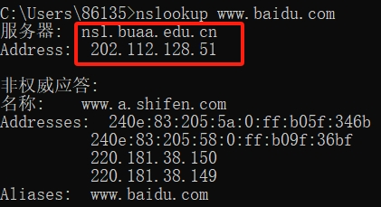
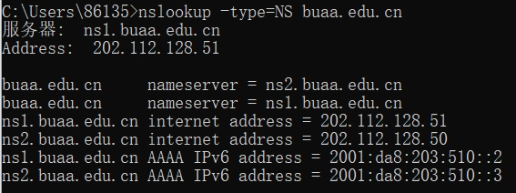
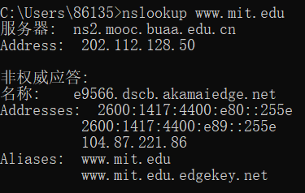
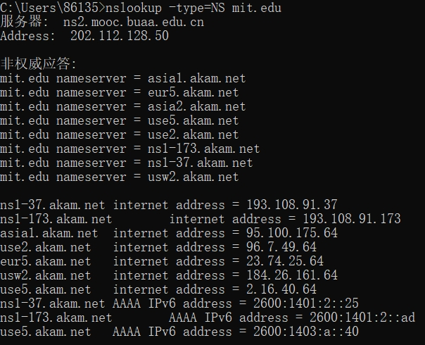
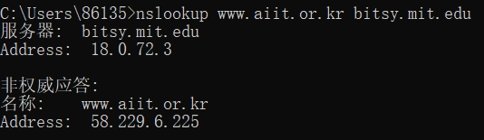
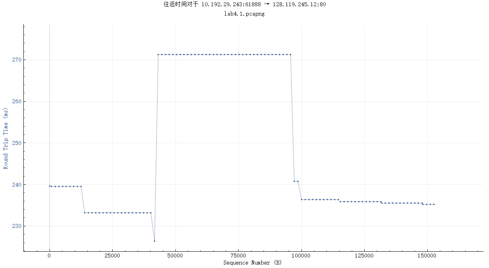
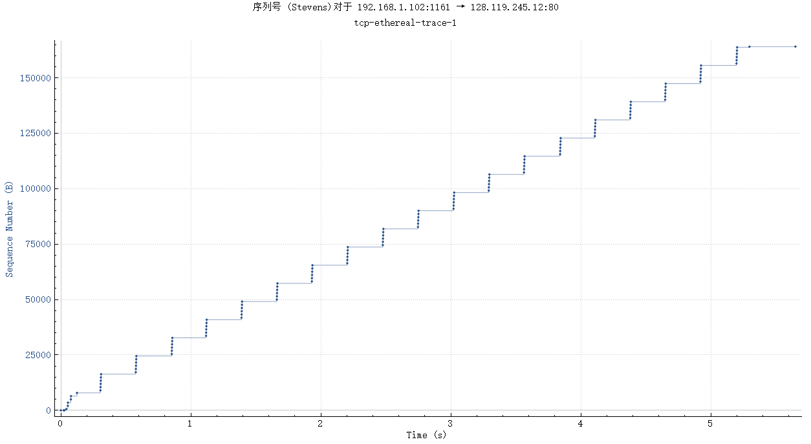
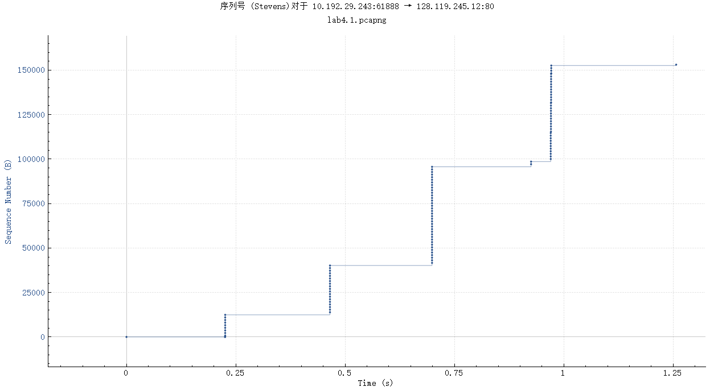

### WireShark Labs

- edge在点击链接时会自动将http变成https

#### Lab1 INTRO

开始捕获分组，随后打开**谷歌浏览器**进行实验。

- 查看链路层(Ethernet)，可以看到 48 位的机器地址，24位是厂商的，24位是个人的
- 查看网络层(IPV4)，可以看到IP地址。
- 查看传输层，可以看到端口号，滑动窗口等等细节

在三次握手的时候观察报文可能出现 FIN与ACK，SYN与ACK 这样的标志结合的报文.

三次握手首先 SYNC 随后 SYNC-ACK 最后 ACK

- 查看应用层，可以看到很熟悉的 HTTP 报文

---

#### Lab2 HTTP

##### Lab2.1

1. Is your browser runnig HTTP version 1.0 or 1.1? What version of HTTP is the server running? 
   - HTTP 1.1 从发送报文看出
   - HTTP 1.1 从应答报文看出

2. What languages (if any) does your browser indicate that it can accept to the server? 
   - zh-CN, zh; q=0.9 **(zh-CN 表示简体中文，q 表示权重)**

3. What is the IP address of your computer? Of the gaia.cs.umass.edu server?
   - 10.194.96.135 学校图书馆
   - 128.119.245.12

4. What is the status code returned from the server to your browser? 
   - 200 :ok:

5. When was the HTML file that you are retrieving last modified at the server?
   - Last-Modified: Sun, 22 Oct 2023 05:59:01 GMT\r\n

6. How many bytes of content are being returned to your browser? 
   - Content-length: 128

7. By inspecting the raw data in the packet content window, do you see any headers within the data that are not displayed in the packet-listing window? If so, name one.

   - HTTP 内容没有显示在 Header 中

   

##### Lab2.2

8. Inspect the contents of the **first** HTTP GET request from your browser to the server. Do you see an “IF-MODIFIED-SINCE” line in the HTTP GET? 
   - Yes
   - **If-Modified-Since**: Sun, 22 Oct 2023 05:59:01 GMT\r\n
9. Inspect the contents of the server response. Did the server explicitly return the contents of the file? How can you tell?
   - Yes
   - 点进packet，查看到报文内容
10. Now inspect the contents of the second HTTP GET request from your browser to the server. Do you see an “IF-MODIFIED-SINCE:” line in the HTTP GET? If so, what information follows the “IF-MODIFIED-SINCE:” header?
    - Yes
    - 与第一次请求报文中的 Last-Modified: Sun, 22 Oct 2023 05:59:01 GMT\r\n 一致
11. What is the HTTP status code and phrase returned from the server in response to this second HTTP GET? Did the server explicitly return the contents of the file? Explain.
    - 304 Not Modified
    - 条件 GET
    - 如果 Last-Modified 小于这个值则无需修改

##### lab2.3

- 使用捕获条件：`ip.addr == 128.119.245.12`

12. How many HTTP GET request messages did your browser send? Which packet number in the trace contains the GET message for the Bill or Rights? 
    - 1
    - 28
13. Which packet number in the trace contains the status code and phrase associated with the response to the HTTP GET request? 
    - 35
14. What is the status code and phrase in the response? 
    - 200 :ok:
15. How many data-containing TCP segments were needed to carry the single HTTP response and the text of the Bill of Rights?
    - 1 + 3

##### lab2.4

~~因为挂不了代理，所以两张图片只能显示一张。这里可以使用官方提供的抓取好的分组来做~~

- 16 用的自己的做，17用的官方提供的

16. How many HTTP GET request messages did your browser send? To which Internet addresses were these GET requests sent? 
    - 3
    - 128.119.245.12 -> 网页内容
    - 128.119.245.12 -> pearson.png
    - 178.79.137.164 -> 8E_cover_small.jpg
      - status code 301: 永久重定向
      - location: 表明了重定向网址，是一个https的网址
17. Can you tell whether your browser downloaded the two images serially, or whether they were downloaded from the two web sites in parallel? Explain.
    - 并行的下载
    - 关注端口号会发现浏览器分别为 3 个IP 开了三个端口号 4307/4308/4309，所以应该是并行的下载

##### lab2.5

18. What is the server’s response (status code and phrase) in response to the initial HTTP GET message from your browser?
    -  HTTP/1.1 401 Unauthorized\r\n
19. When your browser’s sends the HTTP GET message for the second time, what  new field is included in the HTTP GET message?
    - Authorization

---

#### Lab3 DNS

##### lab3.1 nslookup

- `nslookup domain [dns server]`

1. Run nslookup to obtain the IP address of a Web server in Asia. What is the IP address of that server?

   - `nslookup www.baidu.com`

   

   - 非权威应答说明是某 DNS Server 的缓存结果

2. Run nslookup to determine the authoritative DNS servers for a university in Europe. 

   - 这里就查询北航的：`nslookup -type=NS buaa.edu.cn`

   

   

3. Run nslookup so that one of the DNS servers obtained in Question 2 is queried for the mail servers for Yahoo! mail. What is its IP address?

   - `nslookup www.mail.yahoo.com ns1.buaa.edu.cn`

##### lab3.2 ipconfig/ifconfig

- `ipconfig /all`
- `ipconfig /displaydns` 显示 dns cache
- `ipconfig /flushdns` 清除 dns cache

##### lab3.3 Tracing DNS with Wireshark

4. Locate the DNS query and response messages. Are they sent over UDP or TCP? 

   - UDP

5. What is the destination port for the DNS query message? What is the source port of DNS response message? 

   - 53
   - 53

6. To what IP address is the DNS query message sent? Use ipconfig to determine the IP address of your local DNS server. Are these two IP addresses the same? 

   - 202.112.128.50
   - YES

   下面的使用官方提供的来做，因为抓包的过于复杂

7. Examine the DNS query message. What “Type” of DNS query is it? Does the query message contain any “answers”? 

   - A type
   - 递归查询，因为只发送了一次
     - 观察包，确实如此
     - .... ...1 .... .... = Recursion desired: Do query recursively
   - 不包括

8. Examine the DNS response message. How many “answers” are provided? What do each of these answers contain?

   - 2

9. Consider the subsequent TCP SYN packet sent by your host. Does the destination IP address of the SYN packet correspond to any of the IP addresses provided in the DNS response message? 

   - 有，使用了 IPV6

10. This web page contains images. Before retrieving each image, does your host issue new DNS queries?

    - 发送了多次 DNS

11.  What is the destination port for the DNS query message? What is the source port  of DNS response message?

    - 53
    - 53

12.  To what IP address is the DNS query message sent? Is this the IP address of your  default local DNS server?

    - 202.112.128.50
    - YES

13.  Examine the DNS query message. What “Type” of DNS query is it? Does the  query message contain any “answers”?

    - A type

14.  Examine the DNS response message. How many “answers” are provided? What  do each of these answers contain?

    - 3

15.  Provide a screenshot.

16. To what IP address is the DNS query message sent? Is this the IP address of your  default local DNS server? 
    - 同上
17. Examine the DNS query message. What “Type” of DNS query is it? Does the  query message contain any “answers”?
    - NS type
18. Examine the DNS response message. What MIT nameservers does the response  message provide? Does this response message also provide the IP addresses of the  MIT namesers? 
    - 8个
    - 提供了
19. Provide a screenshot.

20. To what IP address is the DNS query message sent? Is this the IP address of your  default local DNS server? If not, what does the IP address correspond to? 
    - 使用202.112.128.50 查询 `bitsy.mit.edu`的IP，这步使用默认DNS服务器
      - 查询到为 18.0.72.3
    - 使用 18.0.72.3 查询 `www.aiit.or.kr`的IP
21. Examine the DNS query message. What “Type” of DNS query is it? Does the  query message contain any “answers”? 
22. Examine the DNS response message. How many “answers” are provided? What  does each of these answers contain? 
23. Provide a screenshot.

---

#### Lab4 TCP

##### lab 4.1

- Answer the following questions, by opening the Wireshark captured packet file **tcpethereal-trace-1**

1. What is the IP address and TCP port number used by the client computer (source)  that is transferring the file to gaia.cs.umass.edu? To answer this question, it’s  probably easiest to select an HTTP message and explore the details of the TCP  packet used to carry this HTTP message, using the “details of the selected packet  header window” (refer to Figure 2 in the “Getting Started with Wireshark” Lab if  you’re uncertain about the Wireshark windows. 
   - 192.168.1.102
   - TCP port 1161 
2. What is the IP address of gaia.cs.umass.edu? On what port number is it sending  and receiving TCP segments for this connection?
   - 128.119.245.12
   - TCP port 80

If you have been able to create your own trace, answer the following question: 

3. What is the IP address and TCP port number used by your client computer  (source) to transfer the file to gaia.cs.umass.edu? 
   - 10.192.29.243
   - TCP port 61888

分析-启用的协议中 uncheck the HTTP box，随后**关注端口 61888**

4. What is the sequence number of the TCP SYN segment that is used to initiate the  TCP connection between the client computer and gaia.cs.umass.edu? What is it  in the segment that identifies the segment as a SYN segment? 
   - 66677051 （随机序号）
   - Flags： 0x002

5. What is the sequence number of the SYNACK segment sent by gaia.cs.umass.edu  to the client computer in reply to the SYN? What is the value of the  Acknowledgement field in the SYNACK segment? How did gaia.cs.umass.edu  determine that value? What is it in the segment that identifies the segment as a  SYNACK segment? 
   - 3745466775
   - Acknowledgement: 66677052 = 上面的 SYN 的序列号加 1

6. What is the sequence number of the TCP segment containing the HTTP POST  command? Note that in order to find the POST command, you’ll need to dig into  the packet content field at the bottom of the Wireshark window, looking for a  segment with a “POST” within its DATA field.  

   - 3745466776

7. Consider the TCP segment containing the HTTP POST as the first segment in the  TCP connection. What are the sequence numbers of the first six segments in the  TCP connection (including the segment containing the HTTP POST)? At what  time was each segment sent? When was the ACK for each segment received?  Given the difference between when each TCP segment was sent, and when its  acknowledgement was received, what is the RTT value for each of the six  segments? What is the EstimatedRTT value (see Section 3.5.3, page 242 in  text) after the receipt of each ACK? Assume that the value of the  EstimatedRTT is equal to the measured RTT for the first segment, and then is  computed using the EstimatedRTT equation on page 242 for all subsequent  segments. 

   >  Note: Wireshark has a nice feature that allows you to plot the RTT for  each of the TCP segments sent. Select a TCP segment in the “listing of  captured packets” window that is being sent from the client to the  gaia.cs.umass.edu server. Then select: Statistics->TCP Stream Graph- >Round Trip Time Graph. 

   - 前六个报文段
     1. 发出 POST 请求：序号 66677052 确认号 3745466776
     2. 剩余 5 个全部是发送数据的报文段 且确认号与第一个一致，序号依次为 第一个的序号 + 1460（单个TCP报文段携带的最大长度为 1460）
   - 记录的是相对时间，TCP流的第一帧为0。
   - 分别为 0.225636s | 剩余的全部为 0.225729s
   - 在 0.465259s 被接收到（第一个 ACK 号大于第六个的序号的包） 
   - 对于 RTT，这里是累积确认，所以没法计算，将范围扩大
   - RTT 分别大约为为 239，233，226，271，241，237...ms
   - 
   - EstimatedRTT = （1 - a） • EstimatedRTT + a • SampleRTT
   - 估计的 RTT 依次为 239（实际 233），238.25（实际 226），236.72（实际 271），241（实际 241），241（实际 237），240.5ms

8. What is the length of each of the first six TCP segments?

9. What is the minimum amount of available buffer space advertised at the received  for the entire trace? Does the lack of receiver buffer space ever throttle the  sender? 

   - 窗口始终足够
   - 事实上，即窗口为 0 ，发送方也不会阻塞，而是持续发送 1 个字节的报文来等待接收方回传 ACK 通知接收窗口的改变

10. Are there any retransmitted segments in the trace file? What did you check for (in  the trace) in order to answer this question? 

11. How much data does the receiver typically acknowledge in an ACK? Can you  identify cases where the receiver is ACKing every other received segment (see  Table 3.2 on page 250 in the text). 

    - 153076 bytes（略大于实际大小 152138 bytes）

12. What is the throughput (bytes transferred per unit time) for the TCP connection?  Explain how you calculated this value.

    - 153076 * 8 / 1.2 = 1Mbps
    - bps 指的是 比特每秒，常说的 1Mbps 即 125 KB/s

13. Use the Time-Sequence-Graph(Stevens) plotting tool to view the sequence  number versus time plot of segments being sent from the client to the  gaia.cs.umass.edu server. Can you identify where TCP’s slowstart phase begins  and ends, and where congestion avoidance takes over? Comment on ways in  which the measured data differs from the idealized behavior of TCP that we’ve  studied in the text.

    - 
    - 大约 0.1s 开始拥塞避免
    - 与理想的 TCP 有些许不同，这里慢启动到达拥塞避免过程中的阈值一开始是一个固定的值，而书上的说法是 先用一次慢启动直到超时，将这个值设为阈值

14. Answer each of two questions above for the trace that you have gathered when  you transferred a file from your computer to gaia.cs.umass.edu

    - 
    - 可以看到序号的量两倍的上涨，直到大约0.7s 之后开始拥塞避免
