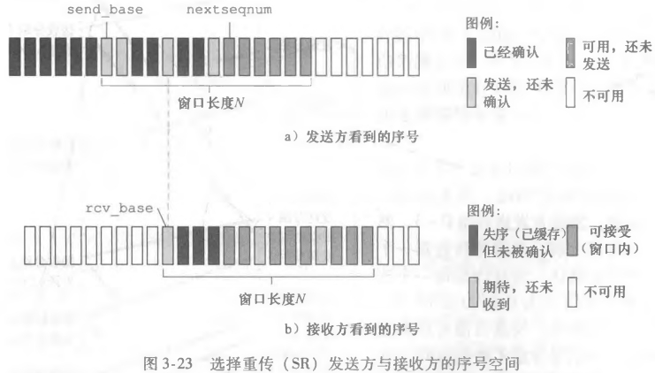

#        a算机网络-自顶向下方法

---

## 第1章 计算机网络和因特网

### 1.1 什么是因特网

- 主机=端系统 诸如电视、手机等等接入因特网的设备
- 端系统通过**通信链路**和**分组交换机**（packet switch）的网络连接在一起
  - 链路的传输速率以比特/秒（bps）来度量
  - 当一台端系统向另一台端系统发送数据，发送端系统将数据分段并为每段加上首部字节，由此形成的信息包就是**分组**（packet）
  - 分组交换机从一条入通信链路接收到达的分组并向一条出通信链路转发该分组
  - 常见的分组交换机：**路由器**（router）和**链路层交换机**（link-layer switch）
- 端系统通过因特网服务提供商 (Internet Service Provider, ISP) 接入因特网
- 因特网标准由因特网工程任务组 (Internet Engineering Task Force, IEIF) 研发。IEIF的标准文档称为**请求评论** (Request For Comment, RFC)

> **协议**（protocol）：定义了在两个或多个通信实体之间交换的报文的格式和顺序，以及报文的发送/接收或其他事件所采取的操作。

### 1.2 网络边缘

#### 1.2.1 接入网

- 接入网是指将端系统**物理连接**到其边缘路由器的网络。边缘路由器：端系统到任何远程端系统到的路径上的第一台路由器。
  1. 家庭接入：DSL、电缆、FTTH和5G 需要调制解调器来转换模拟信号与数字信号
     - DSL：数字用户线，用户从提供本地电话的电话公司获得DSL因特网接入，因此本地电话公司是其ISP
       - 住宅电话线同时承载了数据和传统的电话信号
       - 频分复用：0~4kHz 电话 4kHz~50kHz 上行数据 之后为下行数据
       - **中国早期的拨号上网就是 ASDL**
     - 电缆因特网接入：住宅从提供有线电视的公司获得了电缆因特网接入
     - FTTH（Fiber To The Home）：光纤接入
  2. 企业（和家庭）接入：以太网和WiFi
     - 以太网是最流行到的局域网（LAN）技术
     - WiFi 基于 IEEE 802.11 的无线LAN

#### 1.2.2 物理媒介

- 双绞线，受通信距离影响距离大，成为高速LAN联网的主导解决方案
- 光纤支持极高的比特速率，信号衰减极低

### 1.3 网络核心

#### 1.3.1 分组交换

- 端系统彼此交换报文。某端系统或分组交换机发送一个长 $L$ bit的分组，链路的传输速率为 $R$ bps，则传输该分组时间为 $\frac{L}{R}$ s
  1. 存储转发传输
     - 对于一个分组以及 N 条链路（N-1台交换机），传输时间 $d_{end-end}=N\frac{L}{R}$
     - 对于 P 个分组，$d_{end-end}=(N+P-1)\frac{L}{R}$
  2. 排队时延和分组丢失
     - 分组交换机有一个**输出队列**，如果当分组到达时交换机忙于传输别的分组，则该分组进入队列等待（**排队时延**）。如果队列已满，则发生**分组丢失**（丢包）
     - 排队时延是变化的，取决于网络的拥塞等级
  3. 转发表和路由选择协议
     - 通过该协议自动设置转发表

#### 1.3.2 电路交换

- 端系统通信期间预留资源。未获得连接资源的用户只能等待。
- 通过频分复用或时分复用，一个帧被分为多个时隙，每个时隙对应一个连接
- 在连接期间，即使电路空闲，资源也仍被占有，不够经济

**对比**

- 分组交换更有效，电路交换用于传统的电话网络

> 假定多个用户共享一条1Mbps的链路，假定每个用户有10%的时间活跃，活跃期以100kbps到的恒定速率产生数据

- 对于电路交换：共可支持十个并发的用户连接
- 对于分组交换：35个用户同时11个及以上的概率是0.0004。十个及以下的用户和电路交换一样，十个以上的用户仍然支持，只是产生一定的排队时延

> 假定一个用户突然产生 1000 个1000bit的分组，其他用户静默

- 对于电路交换：每帧的十个时隙中的一个用来传输该用户 10s
- 对于分组交换：1s

#### 1.3.3 网络的网络

- 端系统经过一个接入ISP与因特网连接
- ISP有层次，每个低层次ISP向高层次ISP付费
  - 在中国，每个城市有接入ISP，它们与省级ISP连接，省级ISP又与国家级ISP连接，国家级ISP最终与第一次层ISP连接
- 除了第一层ISP的任何ISP可以**多宿**，即与多个上级ISP连接，容灾
- 位于相同等级的ISP可以**对等**，流量直接连接而无需经过上级ISP
- 第三方公司能创造**因特网交换点**（Internet Exchange Point，IXP），IXP是一个汇合点，多个ISP在这里一起对等
- **内容提供商**网络，多个数据中心通常位于IXP中，谷歌专用网络只承载谷歌服务器的流量。通过与低层次的ISP对等，减少向顶层ISP付费

### 1.4 分组交换网中的时延、丢包和吞吐量

#### 1.4.1 分组交换网中的时延

1. 处理时延
   - 比如路由表的转发选择，检查包的差错
2. 排队时延
3. 传输时延
   - 将分组从主机、路由器推向链路的时延
4. 传播时延
   - 在链路上传播分组的时延，传播速率取决于物理媒介，一般略小于光速
   - $\frac{d}{s}$ 其中 $d$ 是距离，$s$ 是传播速率
5. $d_{total}=d_{proc}+d_{queue}+d_{trans}+d_{prop}$

#### 1.4.2 排队时延和丢包

- $a$ 表示分组到达队列的平均速率，$R$ 传输速率，所有分组有 $L$ bit
- $\frac{La}{R}$称为流量强度，如果大于一，则队列无限增长
- [Interactive Animations | Kurose/Ross, Computer Networking: a Top-Down Approach, 8/e (pearsoncmg.com)](https://media.pearsoncmg.com/ph/esm/ecs_kurose_compnetwork_8/cw/#interactiveanimations)

#### 1.4.3 端到端时延

- $d_{end-end}=N(d_{proc}+d_{trans}+d_{prop})$
- 忽略排队时延
- `traceroute`

#### 1.4.4 计算机网络中的吞吐量

- 吞吐量，比如接收文件的速率，单位（bps）
- 一条路径的吞吐量取决于**瓶颈链路**的传输速率
  - $\min{R_1, R_2, \dots R_N}$
  - 这揭示了因特网中对吞吐量的限制通常是接入网
  - 同时一条高速链路也可能成为瓶颈链路，因为可能多个用户在使用

### 1.6 面对攻击的网络

- **拒绝服务攻击**（Denial-of-Service，Dos），进一步的分布式拒绝服务攻击（Distributed Dos）
  - 弱点攻击：向易受攻击的应用程序发送制作精细的报文
  - 带宽泛洪：攻击者向目标主机发送大量分组
  - 连接泛洪：攻击者在目标主机创建大量的半开或全开的TCP连接

---

## 第2章 应用层

### 2.1 网络应用原理

- 研发网络应用程序核心是写出**运行在不同的端系统和通过网络彼此通信的程序**

#### 2.1.1 网络应用体系结构

1. CS架构
2. P2P架构，如比特彗星

#### 2.1.2 进程通信

1. 客户和服务器进程
2. 进程与计算机网络间的接口，套接字
3. 进程寻址，IP地址标识主机，端口号表示应用程序

#### 2.1.3 应用程序服务要求

1. 可靠数据传输
2. 吞吐量，如电子邮件、文件传输
3. 定时，如游戏
4. 安全性

### 2.2 Web和HTTP  

####  2.2.1 HTTP 概述

- HTTP基于TCP，所以不用担心数据丢失，也不关注底层细节
- 无状态协议（stateless protocol）

#### 2.2.2 非持续连接和持续连接

1. 非持续连接
   - 每个TCP连接在服务器发送一个对象后关闭
   - **RTT**（Round-Trip Time）往返时间，一个分组从客户到服务器再到客户的时间，包括之间讨论的时延
   - 
   - 传输每个文件大约2个RTT（不算挥手）
   - 可以看到在握手的最后阶段，可以顺便带一个HTTP请求
   - HTTP 1.0
2. 持续连接
   - HTTP 1.1
   - 若一段时间未使用，服务器关闭连接

#### 2.2.3 HTTP报文格式

- 抓个包
- 写网站过程中对GET和POST的思考
  - 信息放在 header 中，还是 body 中
- 状态码：200 301（永久重定向） 400（Bad Request） 404（Not Found）

#### 2.2.4 cookie

- 标识用户身份

#### 2.2.5  Web缓存

- 也叫代理服务器（Proxy）
- 其又是客户，又是服务器
- 大大减少因特网上的Web流量

> 假设对象的平均长度为1Mb,从机构内的浏览器对这些初始服务器的平均访问速率为每秒15个请求。我们还假设在图2・12中从因特网接入链路一侧的路由器转发HTTP请求报文（在一个IP数据报中）开始，到它收到其响应报文（通常在多个 IP数据报中）为止的时间平均为2秒。我们非正式地将该持续时延称为“因特网时延” 。

- 局域网上的流量强度：$15 * 1 / 100 = 0.15$
- 接入链路上的流量强度：1，所以时延很大
- 方法1：将接入链路升级为100Mbps，故此时时延主要为因特网时延 2s
- 方法2：加入代理，命中率为0.4
  - 40%请求延迟在10ms（1Mb/100Mbps  * 1s）内 
  - 流量强度变为0.6
  - 平均时延：$0.4 * 0.01 + 0.6 * 2 = 1.204s$

**条件GET**

- 为了避免缓存返回旧的结果，代理会保存 Last-Modified，并在后续的请求中带上 If-Modified-Since 信息，如果未修改，则用缓存返回给客户
- 现在浏览器本身也会缓存网页，所以抓包之会发现也有 If-Modified-Since 的信息，浏览器有了代理的功能

#### 2.2.6 HTTP/2

- 队首阻塞，假设一个TCP传输网页。网页有一个视频和多个图像，那么如果先传输视频，图像将一直得不到传输。HTTP1.1 通过开多个TCP缓解这个现象
- 提供HTTP首部字段的有效压缩，实际就是对部分信息进行数字编码

1. HTTP/2 成帧
   - 将每个报文分成小帧，并在相同TCP上交错发送请求和响应报文
   - 考虑上面的例子，假设视频1000帧，8个小对象每个2帧，那么视频片段发送1帧后，发送小对象的1帧，依次发送，18帧后小对象全部发送完毕
   - 减少用户感知时延
   - 帧的拆分与组装由 HTTP/2 的**成帧子层**完成
2. 响应报文的优先次序和服务器推
   - 可以为报文分配权重，服务器为高权重的响应发出第一帧
   - 服务器可以在做出对初始请求的响应后向该连接发送多个响应，即无需客户多余的请求，向客户推额外的对象
     - 通过分析 HTML 页，识别需要的对象并发送
3. HTTP/3
   - QUIC 基于 UDP

### 2.3 因特网中的电子邮件

### 2.4 DNS：因特网的目录服务

- 通过域名查询IP

#### 2.4.1 DNS 提供的服务

- DNS（Domain Name System） 一个由分层的DNS服务器实现的**分布式数据库**，一个使主机能查询该数据库的分布式协议，基于UDP，使用53端口
- 主机别名：域名通常都是好记的别名，通过别名查询到真正的名字，以及其IP
- 邮件服务器别名
- 负载均衡

#### 2.4.2 DNS 工作机理

- 分布式、层次数据库

- 首先与根DNS服务器联系获得 com 域DNS服务器IP，依次倒推获得IP
- 还存在着本地DNS服务器，很像代理
  - 每个ISP，比如小区ISP，都有一台本地DNS服务器
  - 当主机与ISP相连，通过DHCP获得该DNS的IP
- 迭代查询
  - 
- 递归查询
  - 
- 通常模式像图2-18，向本地服务器的查询是递归的，别的是迭代的
- **DNS缓存**
  - 有一个过期时间
  - 缓存返回的不是最权威DNS服务器返回的

#### 2.4.3 DNS记录和报文

- DNS服务器中存储**资源记录**（Resource Record，RR）
  - 是一个四元组（Name，Value，Type，TTL）
- Type=A:
  - Name 主机名，Value IP
- Type =NS：
  - Name 域，Value 一个直到如果获得该域中主机IP的权威DNS服务器的主机名
- Type=CName
  - Value 是主机别名 Name 对应的规范主机名

### 2.5 P2P 文件分发

### 2.6 视频流和内容分发网

#### 2.6.1 因特网视频

- 对其来说，平均吞吐量最重要

#### 2.6.2 HTTP流和DASH

- 当客户观看视频，客户向服务器创建TCP连接发送GET请求，服务器发送视频并被客户缓存，而视频程序读取缓存播放。
- DASH（Dynamic Adaptive Streaming over HTTP，DASH）经HTTP的动态适应性流
  - 即自定义画质，会随客户带宽的变化而变化清晰度 

#### 2.6.3 内容分发网

- 大型公司使用

1. 用户访问 `www.NetCinema.com` 
2. 点击链接 `http://video.netcinema.com/6Y...`后发送对于`video.netcinema.com`的DNS请求
3. LDNS将请求中继到权威服务器，服务器观察到`video`后不返回IP，而是返回 KingCDN 的域名
4. LDNS接着查询该域名的IP，此时DNS进入了 KingCND的专用DNS基础设施，其根据某策略选择一个服务器IP返回
   - 简单的策略比如：根据地理位置远近
   - 实时测量
5. LDNS返回IP
6. 客户与该服务器连接

### 2.7 套接字编程

---

## 第3章 运输层

### 3.1 概述和运输层服务

- 运输层为运行在**不同主机**上的**应用进程**之间提供了逻辑通信
- 运输层协议是在端系统而非路由器中实现的。在发送端，运输层将要发送的应用层的报文分块并加上首部，使其转换成运输层**报文段**（Segment），再将其交给网络层

#### 3.1.1 运输层和网络层的关系

- 运输层为运行在**不同主机**上的**应用进程**之间提供了逻辑通信
- -网络层为主机之间提供逻辑通信

#### 3.1.2 因特网运输层概述

- UDP（用户数据报协议）
  - 不可靠，无连接
  - 流量不可调节
- TCP（传输控制协议）
  - 可靠，面向连接
  - 流量控制，定时器，拥塞控制等等

### 3.2 多路复用和多路分解

- 传输层将两个端系统间IP的交付服务扩展为运行在端系统上的两个进程之间的交付服务。
- 多路分解：将接收到的数据转发给正确的套接字
- 多路复用：多个套接字收集数据进行发送

1. 无连接的（UDP的）多路复用与多路分解
   - 一个UDP套接字由一个二元组组成：（目的IP，目的port）
   - 一般，服务器端设置一个约定的port，客户端随机生成端口号
2. 面向连接的（TCP的）多路复用与多路分解
   - 套接字由一个四元组标识（源IP，源port，目的IP，目的port）

### 3.3 无连接运输：UDP

- UDP只是做了运输协议能做的最少工作，除了复用分解以及少量的差错检测外，几乎没对IP加什么东西
- 好处
  - 关于发送什么数据以及何时发送控制更为精细。TCP有拥塞控制，而UDP是实时的
  - 无须连接建立
  - 无连接状态，不用维护状态，使服务器能处理更多的请求
  - 分组首部开销更小，TCP20，UDP8

### 3.4 可靠数据传输原理

- 传输数据比特不会受到损坏或丢失，所有数据按照发送顺序进行交付

- 实现这种服务是**可靠数据传输协议**（Reliable data transfer protocol）的责任

  

#### 3.4.1 设计一个可靠数据传输协议

1. 经完全可靠信道的可靠数据传输：rdt1.0

2. 经具有比特差错信道的可靠数据传输：rdt2.0

- 差错检测：检测到发生了比特差错
- 接收方反馈：通过ACK进行反馈
- 重传：发送方收到反馈后选择重传

- 当发送方等待ACK时，不能发送别的数据。这成为停等（stop and wait）协议
- 此时我们担心ACK或NAK分组受损
  - 解：发现ACK或NAK分组受损，则重传请求。
    - 引入冗余分组，接收方不知道ACK是否被正确接收，所以此次的分组不知道时新的还是重传
    - **接收方可能会多次处理相同的包，造成问题**
    - 解：引入序号（sequence number），见下图，只有序号正确才会处理数据
      - 同时，因为这里模型简单，序号只有0和1，标识上一次是重传还是新的

- 更进一步的，如果我们对当前分组NAK，那么我们可以对上一个分组发送ACK代表NAK。也就是ACK也有序号

3. 经具有比特差错和丢包信道的可靠数据传输：rdt3.0
   - 不论是发送方丢失还是接收方ACK返回丢失，发送方都在一定时间内收不到响应。只要一段时间未收到响应，则确定分组丢失，重传分组。
   - 发送方  加入一个 timer 即可

#### 3.4.2 流水线可靠数据传输协议

- rdt3.0正确，但因为是停等协议，性能很低

> 两个端系统间光速往返传播时延RTT约为30ms，信道发送速率$R$为1Gbps，一个分组8000bit。发送一个分组进入链路需要$d_{trans}=\frac{L}{R}=8\mu s$。假设ACK很小传输时延不计，那么在$30.008s$，发送方收到ACK，准备传输下一条请求。利用率$U_{sender}=\frac{L/R}{RTT+L/R}=0.00027$。即使链路传输速率很高，吞吐量也只有267kbs

- 解：流水线，允许用户发送多个分组而无需等待。但对可靠数据传输协议带来以下影响：
  - 增加序号范围，每个分组中有一个唯一的序号
  - 发送和接收方需要能缓存分组。如：发送方需要缓存已发送但未确认的分组
  - 新的差错恢复技术：**回退Ｎ步**（Go-Back-N，GBN）和**选择重传**（Selective Repeat，SR）

#### 3.4.3 回退N步

- 又称**滑动窗口协议**

- N 是已发送但未确认的分组数目。为什么要限制为N？：流量控制
- 对于GBN发送方：
  - 当上层调用`rdt_send()`发现窗口已满，可以通过条件变量等待
  - 收到ACK，累积确认，即对序号为n的分组发送ACK表明所有分组都ACK。如果接收到的包失序，则丢弃，**对之前确认的包发ACK**。（**选择重传**中这里的行为会变）
  - 超时事件，定时器对最早的发送未确认的分组计时

#### 3.4.4 选择重传

- 即缓存收到的失序的分组
- 发送方：
  - 如果窗口满同上
  - 超时，每个分组维护一个定时器，因为此时超时只需重传一个分组，后续的分组未必超时
  - 收到ACK：如果是窗口内的ACK，则将其标记为已确认，如果正好为`send_base`的ACK，则前进窗口
- 接收方：
  - 窗口内的数据被正确接收，如果正好为`rcv_base`的分组，则将其以及之后缓存的分组一同交付给上层，并移动窗口
  - 如果序号在`[rcv_base-N, rcv_base-1]`，则回复相应的ACK。这一步是为了防止之前的ACK丢失，**如果不回复ACK，则发送方无法前进窗口**
  - 别的范围：忽略
- 可以看到两方窗口并不同步，如果窗口过大会造成问题，窗口大小<=序号空间的一半

### 3.5 面向连接的运输：TCP

#### 3.5.1 TCP连接

- 点对点的连接，两端各自维护一个缓存

#### 3.5.2 TCP报文结构

1. 序号和确认号
   1. 序号是字节流首字节的编号
   2. 主机 A 填充进报文段的确认号是主机 A 期望从主机 B 收到的下一字节的序号
   3. 累积确认，TCP 确认该流中第一个丢失字节为止的字节

#### 3.5.3 往返时间的估计与超时

- 超时重传时间间隔要大于RTT，所以我们要估计它

1. 估计往返时间
   - 采样RTT，SampleRTT，即最近的一次RTT
   - 指数加权移动平均：EstimatedRTT = （1 - a） • EstimatedRTT + a • SampleRTT （a 推荐 0.125）
   - RTT偏差：$DevRTT = (1 -\beta) *DevRTT +\beta *|SampleRTT-EstimatedRTT|$ （$\beta$ 推荐 0.25）
     - 如果 SampleRTT 波动很大，那么 DevRTT 就会很大
2. 估计重传间隔
   - 应该比一次RTT略大，大太多则不能很快地重传
   - Timeoutinterval = EstiMatedRTT +4 • DevRTT
   - 当出现超时后，Timeoutinterval 会加倍

#### 3.5.4 可靠数据传输

- TCP 在 IP 不可靠的服务上创建了一种**可靠数据传输服务**，确保一个进程从接收缓存中读取的数据流是无损坏、非冗余和按序的数据流

- 简化的 TCP 发送方

  

  
1. 有趣情况的讨论

     - 

     - 只要第二个 ACK 在第二次超时间隔之前到达，那么第二个报文段不会重传  

     - 如果第一个 ACK 丢失但第二个 ACK 到达也没问题，因为**累积确认**

2. 超时间隔加倍

   - 每当超时事件发生，超时间隔被加倍，不使用公式估算
   - 如果另两个事件发生（收到上层数据和收到 ACK）则使用之前的公式估算

3. 超时重传

   - 触发超时重传时间可能过长，通过**冗余ACK**可以较好检测到丢包的情况

   - 如果接收方收到的报文段中间有间隔，即有报文段丢失，则接收方重复发送之前的 ACK 表示 NACK（见 3.4.1 最后）

   - 如果 TCP 收到相同数据的3个 ACK，则 TCP 执行认为报文段丢失，执行**快速重传**，在定时器发生前立刻重传
4. 回退N步还是选择重传

     - 个人觉得更像选择重传

     
#### 3.5.5 流量控制

- **流量控制服务**是一个速度匹配服务，使发送方的发送速率和接收方应用程序的接收速率相匹配
- TCP 可能因为 IP 的堵塞发生拥塞控制，这与流量控制并不同
- 发送方维护一个**接收窗口**，用于指示接收方还有多少缓存空间

> 主机A向B发送一个文件，主机B接收缓存，大小 RcvBuffer。对于主机B，我们定义两个变量
>
> - LastByteRead APP 读取的最后一个字节编号
> - LastByteRcv 从网络中收到的最后一个字节编号，可能未被读取
>
> 那么 LastByteRcv - LastByteRead  <= RcvBuffer。接收窗口为 rwnd，那么 rwnd = RcvBuffer - (LastByteRcv - LastByteRead)。每次发送 TCP 报文，就将 rwnd 放入报文发送给主机 A
>
> 对于主机A，其维护两个变量 LastByteACKed LastByteSent，二者之差表示已发送但未被确认的数据，主机A须保证 LastByteSent - LastByteACKed <= rwnd
>
> 一个细节，当主机B接收窗口为0时，主机A仍然不停发送一个字节的报文段，否则 

     #### 3.5.6 TCP连接管理

1. Client 向 Server 发送一个空报文段，标志位置为 1（SYN）。用户随机选择一个初始序号 client_isn 发送
2. Server 为该 TCP 分配缓存和变量，发送确认号为 client_isn + 1 ，选择自己的初始序号 server_isn，这个报文段被称为 SYNACK 报文段
3. Client 收到后给连接分配缓存和变量，通过将 server_isn + 1 作为确认号发送下一个报文段。这个报文段可以**捎带**数据  

建立连接的阶段有点像攀岩时的攀岩者和保护者。三次握手是为了确认双方都已经准备好了且都知道对方准备好了

- TCP 连接的生命周期中，其在不同的状态间转换
  - 客户 TCP：CLOSED->SYN_SENT->ESTABLISHED->FIN_WAIT_1->FIN_WAIT_2->TIME_WAIT
    - 发送建立连接请求变为 SYN_SENT 收到 ACK 后进入 ESTABLISHED
    - 发送断开连接请求变为 FIN_WAIT_1 收到 ACK 后进入 FIN_WAIT_2 并等待服务器端的 FIN 报文段，收到后发送 ACK 并启动计时器进入 TIME_WAIT，若超时则重传
  - 服务 TCP：CLOSED->LISTEN->SYN_RCVD->ESTABLISHED->CLOSE_WAIT->LAST_ACK
    - 接收 SYN 进入 SYN_RCVD 收到 ACK 后进入 ESTABLISHED、
    - 收到 FIN 进入 CLOSE_WAIT 发送 FIN 进入 LAST_ACK 接收 ACK 关闭连接                

### 3.6 拥塞控制原理

- 在实践中，丢包一般是由网络拥塞引起的

#### 3.6.1 拥塞原因与代价

1. 情况1：两个发送方和一台具有无穷大缓存的路由器
   - 主机A、B发送的速度都为$\lambda_{in}$，链路的容量为$R$（容量即为链路支持的最大传输速率，与之相对的是吞吐量，每秒正确接收的字节数）
   - 
   - 可以看到吞吐量有上限，这个上限由链路容量决定
   - **代价：当分组的速率接近链路容量时，分组经历巨大的排队时延（尽管吞吐量很大）**
2. 情况2：两个发送方和一台具有有限大缓存的路由器
   - 此时可能发生丢包，假设应用程序以$\lambda_{in}$的速度向运输层发送数据，运输层以 $\lambda_{in}'$ 的速度向网络发送数据
   - 
   - 图b假设发送方确定一个分组丢失后再重传，我们可以看到接收吞吐量因为受到重传的影响并不高
   - **代价：发送方必须执行重传以补偿丢包**
   - 图c假设超时重传，吞吐量为一半
   - **代价：发送方遇到大的时延时进行的不必要重传引起链路转发不必要的分组**
3. 情况3：四个发送方和多台具有有限大缓存的路由器及多跳路径
   - 假设多个连接共享一个路由器，若一个连接造成路由器阻塞，占用大量缓存，则别的连接将不断丢包
   - 当一个分组在一条路径上被丢弃，前面经过的所有路径都浪费了，浪费了资源

#### 3.6.2 拥塞控制方法

- 由是否有网络层提供的帮助来决定
- 端到端拥塞控制：网络层不提供帮助，运输层观察网络的行为（超时或3次冗余确认）
- 网络辅助的拥塞控制：比如路由器通知发送方其能支持的最大输出速率

### 3.7 TCP 拥塞控制

  #### 3.7.1 经典的TCP拥塞控制

- TCP 发送方感觉网络没有拥塞则加快发送，反之减慢发送，引出了几个问题：
- 如何限制发送流量？
  - TCP 发送方额外维护一个拥塞窗口 cwnd
  - LastByteSent - LastByteAcked <= min{cwnd, rwnd}
- 如何感知拥塞？
  - 超时或3次冗余ACK
- 如何改变发送速率？
  - 调节 cwnd 的大小（如果调的过大则拥塞，调的过小则没充分利用网络带宽）
- 几个指导原则
  - 丢包意味着阻塞
  - 当非冗余的ACK到达，意味着正常到达，可以增大速率
  - 带宽探测：不断增大速率直到出现丢包等事件才减小，随后再次探测

TCP 部分，以下的每次变化发生在 1 个 RTT 后

1. 慢启动
   - 通常设为一个 MSS 的较小值，随后不断乘 2
   - 发生超时后，设 cwnd 为 1 并重新开始慢启动，记 ssthresh（慢启动阈值）为 cwnd/2
     - 这里设为 1 因为担心甚至 1 个 MSS 会引起拥塞
   - 当 cwnd 超过 ssthresh 后，进入拥塞避免
   - 或 3 次冗余ACK后进入快速恢复
2. 拥塞避免
   - 当进入拥塞避免时，cwnd 大约为上次拥塞时的一半，所以缓慢增加，一次加一个 MSS
   - 若超时，设 cwnd 为 1 并重新开始慢启动
   - 若冗余ACK，则 ssthresh 为此时 cwnd/2，cwnd 为 ssthresh + 3MSS，进入快速恢复
3. 快速恢复
   - 每当收到冗余ACK后增加 cwnd
   - 当丢失报文段的第一个ACK到达，降低 cwnd 进入拥塞避免

- TCP 的快速恢复并非必须，早期没有。即无论超时还是冗余ACK，都在重置 cwnd 后进入慢启动
  - 

4. TCP 拥塞控制：回顾
   - 每个 RTT 内 cwnd 线性增加，当3次冗余ACK后，cwnd 直接减半（线性加，乘性减）故呈锯齿状，符号探测的原则
   - 
5. TCP CUBIC
   - 乘性减或许太过谨慎，接近在丢包时的速度或许更好
   - 这个算法仅在**拥塞控制阶段**与 TCP Reno 不同
     - $W_{max}$ 为最后检测丢包时的 cwnd，$K$ 为假定无丢包下窗口再次达到 $W_{max}$的时间点
     - CUBIC 以当前时间 $t$ 和 $K$的距离的立方为函数增加 cwnd，当 $t$ 远离 $K$时，拥塞窗口增加的长度更快
     - 当 t 超过 K 后，拥塞窗口迅速增加，寻找下一个临界点（说明网络拥塞情况变好了）
     - 相比于锯齿状，变为了三次函数状
   - `netsh interface tcp show supplemental` 发现我的电脑拥塞算法正是 CUBIC，当今大部分电脑似乎都使用此算法 
6. 对 TCP 吞吐量的宏观描述
   - 一条连接的平均吞吐量 $=\frac{0.75\times W}{RTT}$
   - 假设只考虑拥塞避免阶段，TCP 传输速率在 $\frac{W}{2\times RTT}$ 到 $\frac{W}{RTT}$ 之间，因为线性所以取平均

#### 3.7.2 网络辅助明确拥塞通告和基于时延的拥塞控制（PASS）

#### 3.7.3 公平性

- 考虑两个连接共享一个容量为 R 链路的例子，假设连接有相同的 RTT 和 MSS
- 我们希望能在全带宽利用率曲线附近，同时在平等带宽共享曲线附近（交点）
- 
- A 点线性增加（线性加），B 点超过后减少到 OB 中点（乘性减），随后再继续增加，最终收敛到平等带宽功能共享曲线
- 在实际情况中，RTT 较小的能抢到更多的可用带宽

1. 公平性和 UDP
   - 因为拥塞控制，很多应用不想在TCP上运行
   - 从 TCP 来看这不公平，因为 TCP 当网络拥塞会降低速率而 UDP 不会，UDP 可能会压制 TCP流量
2. 公平性和并行TCP
   - 显然可以通过并行 TCP 占用流量（浏览器加载网站时往往会开多个连接）

### 3.8 运输层功能的演化

- 当今的 TCP 有很多更先进版本，如 TCP CUBIC、BBR等
- **QUIC** 
  - 面向连接和安全：
    - QUIC 也是两个端点间面向连接的协议
    - QUIC 是加密的，将用于创建连接和用于鉴别和加密的握手结合，因而更快
    - 相比之下，TCP 握手一个连接，TCP 创建一个 TLS 连接，需要多个 RTT
  - 数据流
    - 比如一个 WEB 页面，每个对象都是一个流，具有一个 ID 包含在报文段中，来自多个流的数据可能包含在一个报文段中（类似 HTTP2 分帧）
  - 可靠的、TCP友好的拥塞控制传输
    - 对于**队首阻塞**，因为 QUIC 按数据流提供可靠、按序的交付，所以丢失的 UDP 报文段仅能影响其承载的那些数据流
  - QUIC 的拥塞控制基于 TCP New Reno，与 Reno 版本有少量区别
  - 同时由于 QUIC 是应用层协议，所以更新比 TCP 和 UDP 快

### 复习题

3. 在主机A和主机B之间有一条TCP连接。假设从主机A传送到主机B的TCP报文段具有源端口号x 和目的端口号y。对于从主机B传送到主机A的报文段，源端口号和目的端口号分别是多少？
   - y，x
4. 描述应用程序开发者为什么可能选择在UDP上运行应用程序而不是在TCP上运行的原因
   - 没有拥塞控制
5. 在今天的因特网中，为什么语音和图像流量常常是经过TCP而不是经UDP发送
   - 防火墙
6. 当某应用程序运行在UDP上时，该应用程序可能得到可靠数据传输吗？如果能，如何实现？
   - 不能，在应用层进行重传
7. 假定在主机C上的一个进程有一个具有端口号6789的UDP套接字。假定主机A和主机B都用目的端口号6789向主机C发送一个UDP报文段。这两台主机的这些报文段在主机C都被描述为相同的套接字吗？如果是这样的话，在主机C的该进程将怎样知道源于两台不同主机的这两个报文段?
   - UDP 套接字由二元组描述，所以套接字是相同的
   - 二者发送报文的 IP 地址不同
8. 假定在主机C端口 80上运行的一个Web服务器。假定这个Web服务器使用持续连接，并且正在接收来自两台不同主机A和B的请求。被发送的所有请求都通过位于主机C的相同套接字吗？如果们通过不同的套接字传递，这两个套接字都具有端口 80 吗？讨论和解释之
   - TCP 套接字是四元组，每个都不同
   - 对
9. 在我们的 rdt 协议中，为什么需要引入序号?
   - 传输的是字节流
   - 我们需要知道是否每一部分都被按序传输快，需要序号标序
10. 在我们的 rdt 协议中，为什么需要引入定时器?
    - 超时重传
11. 假定发送方和接收方之间的往返时延是固定的并且为发送方所知，假设分组能够丢失的话，在协议 rdt3.0 中，一个定时器仍是必需的吗？试解释之。
    - 需要，我们仍然需要一个固定时长的定时器，来确定一个时延后分组丢失
12. 在配套网站上使用Go-Back-N （回退N步）Java小程序
    1. 让源发送5个分组，在这5个分组的任何一个到达目的地之前暂停该动画。然后毁掉第一个分组并继续该动画。试描述发生的情况
       - 后续分组尽管收到了，但因为乱序，所以将它们都丢弃了
       - 过了一段时间后开始重传
    2. 重复该实验，只是现在让第一个分组到达目的地并毁掉第一个确认。再次描述发生的情况
       - 尽管第一个确认丢失了，但因为累积确认，没有异常发生
    3. 最后，尝试发送6个分组。发生了什么情况？
       - 因为窗口大小为 5，所以发送不了
13. 重复复习题R12,但是现在使用 Selective Repeat（选择重传）Java小程序。选择重传和Go-Back-N有什么不同?
    - 第一个分组未收到，收到后续的分组会缓存之；发送方超时重传第一个分组，随后窗口一次性右移5个
    - 没有累积确认，所以同之前的行为一样（因为它不知道第一个分组是否被接收到，接收到：ACK丢失；没接收到：分组发送丢失；不管哪个情况，表现都是其收到后续的 ACK；TCP 通过 ACK 之前的序号来解决这个问题，同时得到了二者的好处）
    - 发送不了
14. 是非判断题：
    1. 主机A经过一条TCP连接向主机B发送一个大文件。假设主机B没有数据发往主机A。因为主机B不能随数据捎带确认，所以主机B将不向主机A发送确认（错，可以随数据捎带确认）
    2. 在连接的整个过程中，TCP的rwnd的长度决不会变化（错，BufferSize - (LastByteRcv - LastByteRead）
    3. 假设主机A通过一条TCP连接向主机B发送一个大文件。主机A发送但未被确认的字节数不会超过接收缓存的大小（对，流量控制）
    4. 假设主机A通过一条TCP连接向主机B发送一个大文件。如果对于这条连接的一个报文段的序号为m，则对于后继报文段的序号将必然是m + 1（错，m+这条报文携带的数据长度）
    5. TCP报文段在它的首部中有一个rwnd字段（对）
    6. 假定在一条TCP连接中最后的SampleRTT等于1秒，那么对于该连接的TimeoutInterval的当前值必定大于等于1秒（TimeoutInterval=EstimatedRTT + 4 * DevRTT）
    7. 假设主机A通过一条TCP连接向主机B发送一个序号为38的4个字节的报文段。在这个相同的报文段中，确认号必定是42（错，收到的确认报文段确认号为44，而不是相同的报文段）
15. 假设主机A通过一条TCP连接向主机B发送两个紧接着的TCP报文段。第一个报文段的序号为90，第二个报文段序号为110
    1. 第一个报文段中有多少数据？（20 字节）
    2. 假设第一个报文段丢失而第二个报文段到达主机B。那么在主机B发往主机A的确认报文中, 确认号应该是多少？（90）
16. PASS
17. 假设两条TCP连接存在于一个带宽为 R bps的瓶颈链路上。它们都要发送一个很大的文件（以相同方向经过瓶颈链路），并且两者是同时开始发送文件。那么TCP将为每条连接分配什么样的传输速率？
    - R / 2

---

## 第4章 网络层：数据平面

- 网络层被分为两个相互作用的部分：数据平面和控制平面
- 数据平面：网络中每台路由器的功能
- 控制平面：路由的方式

### 4.1 网络层概述 

#### 4.1.1 转发和路由选择：数据平面和控制平面

- 两个重要功能
  - 转发：将分组从路由器的输入链路移动到合适的输出链路，数据平面实现的唯一功能
  - 路由选择：决定路径
- 转发在路由器本地发生，由硬件完成（ns）；路由选择决定源到目的地的路径，时间尺度较长（s），一般由软件完成
- 每个路由器内部维护一个转发表，包含网络号和路由器端口的映射；比如：0100 转发到端口3
  1. 控制平面：传统方法
     - 通过与其他路由器通信来计算转发表，通信内容是路由选择报文
  2. 控制平面：SDN 方法（Software-Defined Networking）
     - 由远程控制器来计算转发表并分发给路由器，路由器仅进行转发
     - 远程控制器可能实现在数据中心，由 ISP 管理

#### 4.1.2 网络服务模型

- 即网络层是否可靠，是否提供关于拥塞的反馈信息等。可能的服务：确保交付、具有时延上界的确保交付、有序分组交付等
- 因特网的网络层提供 **best-effort** 服务，没有任何保证，不保证交付、不保证有序，不保证时延等

> 分组交换机是通用的分组交换设备，从输入链路转发到输出链路；链路层交换机（链路层）/路由器（网络层）

### 4.2 路由器工作原理

- 输入端口：三个方框分别代表物理层、链路层和路由查找
- 交换结构：将输入端口连接到输出端口
- 输出端口：从交换结构接收分组，并执行适当的链路层、物理层的功能进行传输
- 路由选择处理器：传统方法中，它执行路由选择协议，维护转发表；SDN中，其负责与远程控制器通信

#### 4.2.1 输入端口处理和基于目的地转发

- 转发表从路由选择处理器经过独立总线复制到线路卡，基于线路卡的副本，路由选择在**每个输入端口**做出而不是集中地调用路由选择处理器
- 转发表一般基于**前缀匹配**（最长前缀匹配）
- 为了加快速度，需要使用快速查找算法；关注内存访问时间（TCAM）
- 大致顺序：物理层和链路层处理拿到 IP数据报；检查分组的版本号、检验和寿命等

#### 4.2.2 交换

1. 经内存交换
   - 最早路由器是传统的计算机
2. 经总线交换
3. 经互联网络交换

#### 4.2.3 输出端口处理

#### 4.2.4 何处出现排队

假定输入线路速度与输出线路速度（传输速率）是相同的，均为$R_{line}$，交换结构速度为 $R_{switch}$。如果有 N 个端口

1. 输入排队
   - 如果交换结构不够快，分组将会在输入端口排队
   - 如果位于两个输入队列前端的两个分组是发往同一输出队列的，则其中的一个分组将被阻塞，且必须在输入队列中等待，因为交换结构一次只能传送一个分组到某指定端口
   - 队首阻塞（HOL）
2. 输出排队
   - 多个输入端口的分组被转发到同一个输出端口
   - 排队的分组如何经过输出链路传输是一个分组调度问题（FIFO、优先权排队、循环和加权公平排队）

###  4.3 网际协议：IPv4、寻址、IPv6及其他

#### 4.3.1 IPv4数据报格式

- 首部长度：可能包含选项，如果不包含则为 20 字节
- 数据报长度：首部加上数据的总长度
- 标识，标志，偏移：和分片有关
- 寿命：TTL
- 协议：UDP、TCP
- 选项：其存在很少使用，但却导致首部长度可变，IPv6 中删除

#### 4.3.2 IPv4数据报分片

- 分片和重新组装，这是端系统的责任，传输的路由器不用管

#### 4.3.3 IPv4编址

1. 获取一块地址
   - 某个 ISP 可能获得 200.23.16.0/20 其可以将其划分为更小的块
2. 获取主机地址：动态主机配置协议（DHCP）
   - 某组织一旦获取块地址，就可以进一步为该组织的主机分配地址
   - DHCP 广泛应用于住宅 企业 无线网 等场所(BUAA)
   - DHCP 是一个客户-服务器协议
   - 需要一个 DHCP 服务器，或是 DHCP 代理，其能与 DHCP 服务器通信
   - 有以下 4 个步骤
     1. DHCP 服务器发现。这通过 **DHCP 发现报文**。广播 端口号为 67 的UDP
     2. DHCP 服务器提供。DHCP 服务器收到发现报文后，广播**DHCP 提供报文**（因为该主机暂时还没有 IP 地址）该报文含有**DHCP租期**、IP、网络掩码、DNS等信息。
     3. DHCP 请求。可能一个子网有多个 DHCP 服务器，客户选择一个，发送 **DHCP 请求报文**进行响应
     4. DHCP ACK

#### 4.3.4 网络地址转换

- 比如：家庭路由器往往就是 DHCP 服务器，其带有 NAT 功能，使外界看起来像只有一个 IP 地址
- 家庭路由器通过 DHCP 从 ISP 获得地址，随后充当 DHCP 服务器，为家庭的端系统提供**专有 IP 地址**
- 本质就是维护一个 端口号 到 IP：端口号 的映射

#### 4.3.5 IPv6

- 固定的 40 字节首部
- 流
- 去除首部检验和
- 选项，其未被删除，可能出现在下一个首部指向的位置
- 对于 IPv4 到 IPv6 的迁移，可以通过**隧道**的方式，即将 IPv6 放在 IPv4 的数据部分
