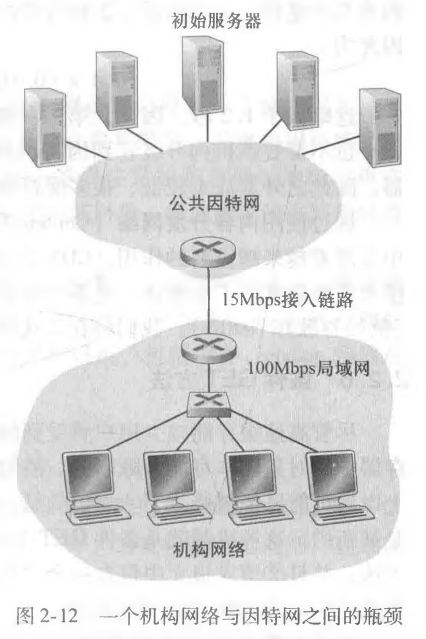
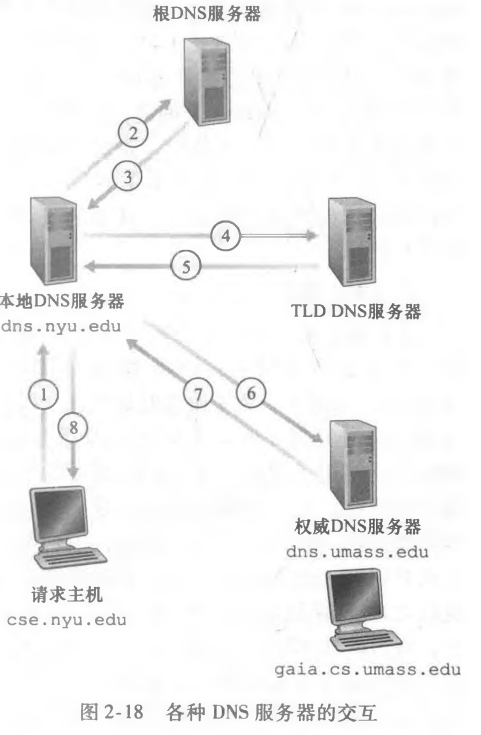

# 计算机网络-自顶向下方法

---

## 第1章 计算机网络和因特网

### 1.1 什么是因特网

- 主机=端系统 诸如电视、手机等等接入因特网的设备
- 端系统通过**通信链路**和**分组交换机**（packet switch）的网络连接在一起
  - 链路的传输速率以比特/秒（bps）来度量
  - 当一台端系统向另一台端系统发送数据，发送端系统将数据分段并为每段加上首部字节，由此形成的信息包就是**分组**（packet）
  - 分组交换机从一条入通信链路接收到达的分组并向一条出通信链路转发该分组
  - 常见的分组交换机：**路由器**（router）和**链路层交换机**（link-layer switch）
- 端系统通过因特网服务提供商 (Internet Service Provider, ISP) 接入因特网
- 因特网标准由因特网工程任务组 (Internet Engineering Task Force, IEIF) 研发。IEIF的标准文档称为**请求评论** (Request For Comment, RFC)

> **协议**（protocol）：定义了在两个或多个通信实体之间交换的报文的格式和顺序，以及报文的发送/接收或其他事件所采取的操作。

### 1.2 网络边缘

#### 1.2.1 接入网

- 接入网是指将端系统**物理连接**到其边缘路由器的网络。边缘路由器：端系统到任何远程端系统到的路径上的第一台路由器。
  1. 家庭接入：DSL、电缆、FTTH和5G 需要调制解调器来转换模拟信号与数字信号
     - DSL：数字用户线，用户从提供本地电话的电话公司获得DSL因特网接入，因此本地电话公司是其ISP
       - 住宅电话线同时承载了数据和传统的电话信号
       - 频分复用：0~4kHz 电话 4kHz~50kHz 上行数据 之后为下行数据
       - **中国早期的拨号上网就是 ASDL**
     - 电缆因特网接入：住宅从提供有线电视的公司获得了电缆因特网接入
     - FTTH（Fiber To The Home）：光纤接入
  2. 企业（和家庭）接入：以太网和WiFi
     - 以太网是最流行到的局域网（LAN）技术
     - WiFi 基于 IEEE 802.11 的无线LAN

#### 1.2.2 物理媒介

- 双绞线，受通信距离影响距离大，成为高速LAN联网的主导解决方案
- 光纤支持极高的比特速率，信号衰减极低

### 1.3 网络核心

#### 1.3.1 分组交换

- 端系统彼此交换报文。某端系统或分组交换机发送一个长 $L$ bit的分组，链路的传输速率为 $R$ bps，则传输该分组时间为 $\frac{L}{R}$ s
  1. 存储转发传输
     - 对于一个分组以及 N 条链路（N-1台交换机），传输时间 $d_{end-end}=N\frac{L}{R}$
     - 对于 P 个分组，$d_{end-end}=(N+P-1)\frac{L}{R}$
  2. 排队时延和分组丢失
     - 分组交换机有一个**输出队列**，如果当分组到达时交换机忙于传输别的分组，则该分组进入队列等待（**排队时延**）。如果队列已满，则发生**分组丢失**（丢包）
     - 排队时延是变化的，取决于网络的拥塞等级
  3. 转发表和路由选择协议
     - 通过该协议自动设置转发表

#### 1.3.2 电路交换

- 端系统通信期间预留资源。未获得连接资源的用户只能等待。
- 通过频分复用或时分复用，一个帧被分为多个时隙，每个时隙对应一个连接
- 在连接期间，即使电路空闲，资源也仍被占有，不够经济

**对比**

- 分组交换更有效，电路交换用于传统的电话网络

> 假定多个用户共享一条1Mbps的链路，假定每个用户有10%的时间活跃，活跃期以100kbps到的恒定速率产生数据

- 对于电路交换：共可支持十个并发的用户连接
- 对于分组交换：35个用户同时11个及以上的概率是0.0004。十个及以下的用户和电路交换一样，十个以上的用户仍然支持，只是产生一定的排队时延

> 假定一个用户突然产生 1000 个1000bit的分组，其他用户静默

- 对于电路交换：每帧的十个时隙中的一个用来传输该用户 10s
- 对于分组交换：1s

#### 1.3.3 网络的网络

- 端系统经过一个接入ISP与因特网连接
- ISP有层次，每个低层次ISP向高层次ISP付费
  - 在中国，每个城市有接入ISP，它们与省级ISP连接，省级ISP又与国家级ISP连接，国家级ISP最终与第一次层ISP连接
- 除了第一层ISP的任何ISP可以**多宿**，即与多个上级ISP连接，容灾
- 位于相同等级的ISP可以**对等**，流量直接连接而无需经过上级ISP
- 第三方公司能创造**因特网交换点**（Internet Exchange Point，IXP），IXP是一个汇合点，多个ISP在这里一起对等
- **内容提供商**网络，多个数据中心通常位于IXP中，谷歌专用网络只承载谷歌服务器的流量。通过与低层次的ISP对等，减少向顶层ISP付费

### 1.4 分组交换网中的时延、丢包和吞吐量

#### 1.4.1 分组交换网中的时延

1. 处理时延
   - 比如路由表的转发选择，检查包的差错
2. 排队时延
3. 传输时延
   - 将分组推向链路的时延
4. 传播时延
   - 在链路上传播分组的时延，传播速率取决于物理媒介，一般略小于光速
   - $\frac{d}{s}$ 其中 $d$ 是距离，$s$ 是传播速率
5. $d_{total}=d_{proc}+d_{queue}+d_{trans}+d_{prop}$

#### 1.4.2 排队时延和丢包

- $a$ 表示分组到达队列的平均速率，$R$ 传输速率，所有分组有 $L$ bit
- $\frac{La}{R}$称为流量强度，如果大于一，则队列无限增长
- [Interactive Animations | Kurose/Ross, Computer Networking: a Top-Down Approach, 8/e (pearsoncmg.com)](https://media.pearsoncmg.com/ph/esm/ecs_kurose_compnetwork_8/cw/#interactiveanimations)

#### 1.4.3 端到端时延

- $d_{end-end}=N(d_{proc}+d_{trans}+d_{prop})$
- 忽略排队时延
- `traceroute`

#### 1.4.4 计算机网络中的吞吐量

- 吞吐量，比如接收文件的速率，单位（bps）
- 一条路径的吞吐量取决于**瓶颈链路**的传输速率
  - $\min{R_1, R_2, \dots R_N}$
  - 这揭示了因特网中对吞吐量的限制通常是接入网
  - 同时一条高速链路也可能成为瓶颈链路，因为可能多个用户在使用

### 1.6 面对攻击的网络

- **拒绝服务攻击**（Denial-of-Service，Dos），进一步的分布式拒绝服务攻击（Distributed Dos）
  - 弱点攻击：向易受攻击的应用程序发送制作精细的报文
  - 带宽泛洪：攻击者向目标主机发送大量分组
  - 连接泛洪：攻击者在目标主机创建大量的半开或全开的TCP连接

---

## 第2章 应用层

### 2.1 网络应用原理

- 研发网络应用程序核心是写出**运行在不同的端系统和通过网络彼此通信的程序**

#### 2.1.1 网络应用体系结构

1. CS架构
2. P2P架构，如比特彗星

#### 2.1.2 进程通信

1. 客户和服务器进程
2. 进程与计算机网络间的接口，套接字
3. 进程寻址，IP地址标识主机，端口号表示应用程序

#### 2.1.3 应用程序服务要求

1. 可靠数据传输
2. 吞吐量，如电子邮件、文件传输
3. 定时，如游戏
4. 安全性

### 2.2 Web和HTTP

#### 2.2.1 HTTP 概述

- HTTP基于TCP，所以不用担心数据丢失，也不关注底层细节
- 无状态协议（stateless protocol）

#### 2.2.2 非持续连接和持续连接

1. 非持续连接
   - 每个TCP连接在服务器发送一个对象后关闭
   - **RTT**（Round-Trip Time）往返时间，一个分组从客户到服务器再到客户的时间，包括之间讨论的时延
   - 
   - 传输每个文件大约2个RTT（不算挥手）
   - 可以看到在握手的最后阶段，可以顺便带一个HTTP请求
   - HTTP 1.0
2. 持续连接
   - HTTP 1.1
   - 若一段时间未使用，服务器关闭连接

#### 2.2.3 HTTP报文格式

- 抓个包
- 写网站过程中对GET和POST的思考
  - 信息放在 header 中，还是 body 中
- 状态码：200 301（永久重定向） 400（Bad Request） 404（Not Found）

#### 2.2.4 cookie

- 标识用户身份

#### 2.2.5  Web缓存

- 也叫代理服务器（Proxy）
- 其又是客户，又是服务器
- 大大减少因特网上的Web流量

> 假设对象的平均长度为1Mb,从机构内的浏览器对这些初始服务器的平均访问速率为每秒15个请求。我们还假设在图2・12中从因特网接入链路一侧的路由器转发HTTP请求报文（在一个IP数据报中）开始，到它收到其响应报文（通常在多个 IP数据报中）为止的时间平均为2秒。我们非正式地将该持续时延称为“因特网时延” 。

- 局域网上的流量强度：$15 * 1 / 100 = 0.15$
- 接入链路上的流量强度：1，所以时延很大
- 方法1：将接入链路升级为100Mbps，故此时时延主要为因特网时延 2s
- 方法2：加入代理，命中率为0.4
  - 40%请求延迟在10ms（1Mb/100Mbps  * 1s）内 
  - 流量强度变为0.6
  - 平均时延：$0.4 * 0.01 + 0.6 * 2 = 1.204s$

**条件GET**

- 为了避免缓存返回旧的结果，代理会保存 Last-Modified，并在后续的请求中带上 If-Modified-Since 信息，如果未修改，则用缓存返回给客户
- 现在浏览器本身也会缓存网页，所以抓包之会发现也有 If-Modified-Since 的信息，浏览器有了代理的功能

#### 2.2.6 HTTP/2

- 队首阻塞，假设一个TCP传输网页。网页有一个视频和多个图像，那么如果先传输视频，图像将一直得不到传输。HTTP1.1 通过开多个TCP缓解这个现象
- 提供HTTP首部字段的有效压缩，实际就是对部分信息进行数字编码

1. HTTP/2 成帧
   - 将每个报文分成小帧，并在相同TCP上交错发送请求和响应报文
   - 考虑上面的例子，假设视频1000帧，8个小对象每个2帧，那么视频片段发送1帧后，发送小对象的1帧，依次发送，18帧后小对象全部发送完毕
   - 减少用户感知时延
   - 帧的拆分与组装由 HTTP/2 的**成帧子层**完成
2. 响应报文的优先次序和服务器推
   - 可以为报文分配权重，服务器为高权重的响应发出第一帧
   - 服务器可以在做出对初始请求的响应后向该连接发送多个响应，即无需客户多余的请求，向客户推额外的对象
     - 通过分析 HTML 页，识别需要的对象并发送
3. HTTP/3
   - QUIC 基于 UDP

### 2.3 因特网中的电子邮件

### 2.4 DNS：因特网的目录服务

- 通过域名查询IP

#### 2.4.1 DNS 提供的服务

- DNS（Domain Name System） 一个由分层的DNS服务器实现的**分布式数据库**，一个使主机能查询该数据库的分布式协议，基于UDP，使用53端口
- 主机别名：域名通常都是好记的别名，通过别名查询到真正的名字，以及其IP
- 邮件服务器别名
- 负载均衡

#### 2.4.2 DNS 工作机理

- 分布式、层次数据库

- 首先与根DNS服务器联系获得 com 域DNS服务器IP，依次倒推获得IP
- 还存在着本地DNS服务器，很像代理
  - 每个ISP，比如小区ISP，都有一台本地DNS服务器
  - 当主机与ISP相连，通过DHCP获得该DNS的IP
- 迭代查询
  - 
- 递归查询
  - 
- 通常模式像图2-18，向本地服务器的查询是递归的，别的是迭代的
- **DNS缓存**
  - 有一个过期时间
  - 缓存返回的不是最权威DNS服务器返回的

#### 2.4.3 DNS记录和报文

- DNS服务器中存储**资源记录**（Resource Record，RR）
  - 是一个四元组（Name，Value，Type，TTL）
- Type=A:
  - Name 主机名，Value IP
- Type =NS：
  - Name 域，Value 一个直到如果获得该域中主机IP的权威DNS服务器的主机名
- Type=CName
  - Value 是主机别名 Name 对应的规范主机名

### 2.5 P2P 文件分发

### 2.6 视频流和内容分发网

#### 2.6.1 因特网视频

- 对其来说，平均吞吐量最重要

#### 2.6.2 HTTP流和DASH

- 当客户观看视频，客户向服务器创建TCP连接发送GET请求，服务器发送视频并被客户缓存，而视频程序读取缓存播放。
- DASH（Dynamic Adaptive Streaming over HTTP，DASH）经HTTP的动态适应性流
  - 即自定义画质，会随客户带宽的变化而变化清晰度 

#### 2.6.3 内容分发网

- 大型公司使用

1. 用户访问 `www.NetCinema.com` 
2. 点击链接 `http://video.netcinema.com/6Y...`后发送对于`video.netcinema.com`的DNS请求
3. LDNS将请求中继到权威服务器，服务器观察到`video`后不返回IP，而是返回 KingCDN 的域名
4. LDNS接着查询该域名的IP，此时DNS进入了 KingCND的专用DNS基础设施，其根据某策略选择一个服务器IP返回
   - 简单的策略比如：根据地理位置远近
   - 实时测量
5. LDNS返回IP
6. 客户与该服务器连接

### 2.7 套接字编程